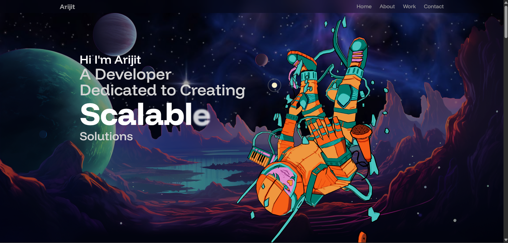

# 🧑‍💻 Personal Portfolio Website

## 📌 Overview
A modern, responsive personal portfolio website designed to showcase projects, skills, and professional background. The site serves as a digital resume and personal brand hub, featuring smooth animations, clean UI sections, and easy navigation to help visitors quickly understand the developer’s expertise and work.

---

## 🎯 Objectives

- Present personal profile, skills, and projects in a clean and professional layout.
- Showcase featured projects with descriptions and live/demo links.
- Provide smooth navigation with section-based scrolling and visual feedback.
- Ensure responsiveness across desktop, tablet, and mobile devices.
- Maintain a lightweight frontend using core web technologies for easy deployment.

---

## 🛠️ Tech Stack Used

| Layer / Component        | Technologies Used    | Description                                                    |
| ------------------------ | -------------------- | -------------------------------------------------------------- |
| **Frontend Framework**   | React.js             | Component-based UI architecture and state management           |
| **Animations**           | Framer Motion        | Smooth page transitions, hover effects, and section animations |
| **3D Graphics**          | Three.js             | Core 3D rendering engine                                       |
| **React 3D Integration** | @react-three/fiber   | Declarative Three.js rendering inside React                    |
| **3D Utilities**         | @react-three/drei    | Helpers for cameras, lights, controls, and loaders             |
| **Styling**              | CSS3 / Modern CSS    | Responsive layouts, spacing, and typography                    |
| **Build Tooling**        | Vite / React Scripts | Fast development server and optimized production builds        |

---

## 🗂️ Project Structure

```
Personal-Portfolio/
├── src/
│   ├── components/
│   │   ├── (UI and layout components)
│   ├── sections/
│   │   ├── Hero.jsx
│   │   ├── About.jsx
│   │   ├── Skills.jsx
│   │   ├── Projects.jsx
│   │   ├── Experiences.jsx
│   │   ├── Footer.jsx
│   │   └── Contact.jsx
│   ├── constants/
│   │   └── index.js
│   ├── public/
│   │   ├── assets/
│   │   │    └── (images, icons, logos)
│   │   └── models/
│   ├── App.jsx
│   └── main.jsx
├──  index.html
└── README.md
```

---

## 🖥️ Preview

**Key Sections**
- Hero section with name, role, and call-to-action buttons
- About section highlighting background and interests
- Skills section displaying technical stack and tools
- Projects section with cards linking to GitHub/live demos
- Contact section with social links and email access

### Preview


---

## 🌐 Public View
This portfolio was deployed in vercel, you can check the live version here:

[🔗 View Live Site](https://personal-portfolio-ten-theta-63.vercel.app/)

---

## ⚙️ Application Behavior

- **Navigation**: Smooth scrolling between sections with active-link highlighting.
- **Responsiveness**: Fully responsive layout adapting to different screen sizes.
- **Animations**: Sections animate into view for a polished user experience.
- **Project Showcasing**: Each project card highlights key work with external links.
- **Performance**: Lightweight assets ensure fast loading and smooth interactions.

---

## 🔗 References

- React: https://react.dev/
- Framer Motion: https://www.framer.com/motion/
- Three.js: https://threejs.org/
- React Three Fiber: https://docs.pmnd.rs/react-three-fiber
- Drei: https://docs.pmnd.rs/drei
- MDN Web Docs – JavaScript: https://developer.mozilla.org/en-US/docs/Web/JavaScript
- CSS-Tricks: https://css-tricks.com/
- Magic UI: https://magicui.design/

<br>

👨‍💻 **Developed by** – @Arijit2175